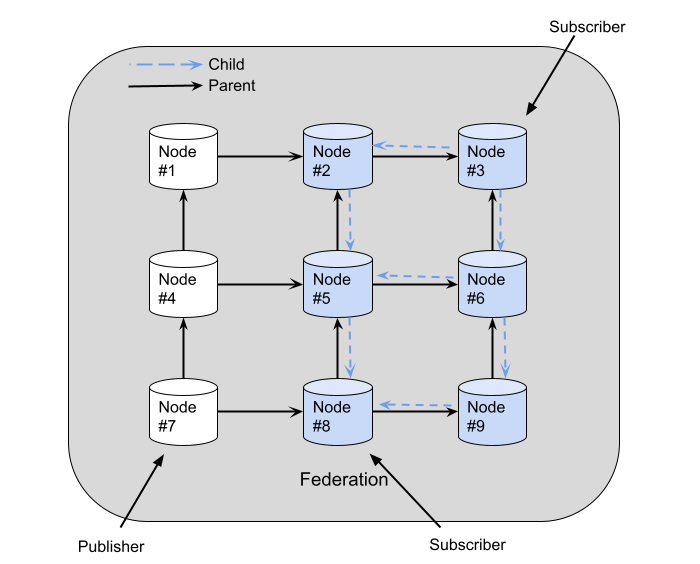

# Evaluation scenario

The evaluation scenario consists of 9 nodes organized in a grid pattern, each node comprehends a mosquitto broker and an instance of the federator.
Two subscribers are placed in this topology, the first at node 3 and the second in node 8. One publisher is placed at node 7.


## Tools needed

- [mqtt-fed (federator)](https://github.com/nicolaskribas/mqtt-fed): Provides federation capabilities to a MQTT broker;
```
cargo install --git https://github.com/nicolaskribas/mqtt-fed.git
```

- [beaconer](https://github.com/nicolaskribas/beaconer): Simulate a subscriber to a federated topic;
```
cargo install --git https://github.com/nicolaskribas/beaconer.git
```

- [mqtt-bm-latency](https://github.com/nicolaskribas/mqtt-bm-latency): Benchmark tool;
```
go install github.com/nicolaskribas/mqtt-bm-latency@latest
```

- docker: Each broker will run in separated docker containers;

## Setting up

### Running the brokers and federators

We provide a [script](make_brokers_containers.sh) to create the nine docker containers, each one running an instance of mosquitto 1.6 that listens on one port in the range from 1881 to 1889. Run the script:
```
./make_brokers_containers.sh
```

For each broker, you will need to run an instance of the federator. In the [configs folder](configs) there is a configuration file for each node. For example, to start the federator in the node 5, run:
```
mqtt-fed -c configs/mqtt-fed5.toml
```

### Prepare mesh

The mesh creation takes some time, so we have to simulate the presence of subscribers, so the mesh creation ends before we run the benchmark with the actual subscribers.

To simulate subscribers at node 3 and 8 run:
```
beaconer -p 1883 -t "bm"
```
and
```
beaconer -p 1888 -t "bm"
```

## Running the benchmark
Example with 1000 messages being published using QoS 2 for both subscriptions and publications:
```
mqtt-bm-latency --topic "federated/bm" --brokersub1 "tcp://localhost:1883" --brokersub2 "tcp://localhost:1888" --brokerpub "tcp://localhost:1887" --count 1000 --pubqos 2 --subqos 2
```
